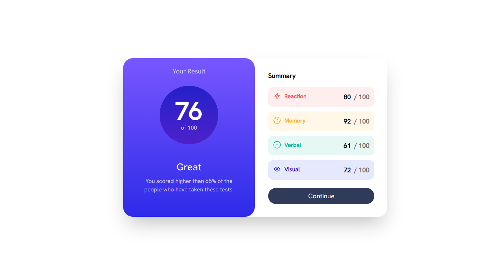

# Frontend Mentor - Results summary component solution

This is a solution to the [Results summary component challenge on Frontend Mentor](https://www.frontendmentor.io/challenges/results-summary-component-CE_K6s0maV). Frontend Mentor challenges help you improve your coding skills by building realistic projects. 

## Table of contents

- [Overview](#overview)
  - [Screenshot](#screenshot)
  - [Links](#links)
- [My process](#my-process)
  - [Built with](#built-with)
  - [What I learned](#what-i-learned)
- [Author](#author)

## Overview

### Screenshot

### Links

- Challenge URL:  [Front End Mentor](https://www.frontendmentor.io/challenges/results-summary-component-CE_K6s0maV)
- Live Site URL: [GitHub Pages](https://your-live-site-url.com)

## My process
I built this project with Tailwind CSS and inline CSS.

### Built with

- HTML5
- CSS
- Flexbox
- Tailwind CSS

### What I learned

During the making of this project, I've practiced various skills in HTML and CSS.

In CSS,
- Color opacity
- Gradients

## Author

- Frontend Mentor - [@FG-ABC](https://www.frontendmentor.io/profile/FG-ABC)

